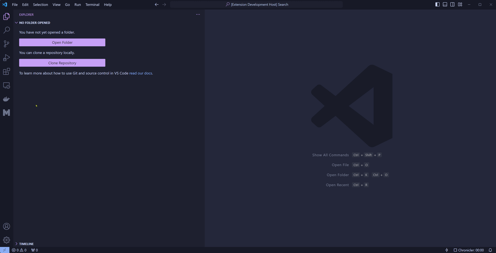

# mistral-vscode

Allows you to chat using the Mistral AI API directly within VS Code.

## Features

- A nice-looking (debatable) chat view
- Select the Mistral model to use on-the-fly, even mid-convo
- Mistral platform responses are streamed to the chat window
- Code blocks highlighting in responses
- Chat history, with the ability to reload a previous chat and resume the conversation
- 2 adaptive color schemes (ugly light/terrible dark)

## Requirements

You'll need a Mistral API key and to set it up in the extension settings.

## Extension Settings

This extension contributes the following settings:

* `mistral-vscode.apiKey`: Your Mistral API key (not synced)
* `mistral-vscode.defaultModel`: The default Mistral model to use : `mistral-tiny`, `mistral-small` or `mistral-medium` as of February 2024 (default: `mistral-tiny`)
* `mistral-vscode.mustSaveChats`: Should VSCode save chat history (default: `false`)
* `mistral-vscode.saveChatsLocation`: If chat history is enabled, the folder in which chats are saved (default: `~/.mistral-vscode/chats/`)
* `mistral-vscode.getChatsTitlesByMistral`: If chat history is enabled, should the extension ask `mistral-tiny` to name chat files with an explicit description (default: `false`). **Enabling this _will_ cause additional Mistral API requests and thus increase billing (though not by much)**

## Known Issues

Formatting issues when lots of backticks are found in the Mistral responses (think: asking questions about regex including backticks).

Then again, even ChatGPT struggles with these cases.

## Release Notes

### v0.0.2

- Better formatting of code terms (not code blocks) during response streaming
- Added `Start new chat` item in context menu
- Tweaked system prompt for getting chat titles from Mistral

### v0.0.1

- Initial release
